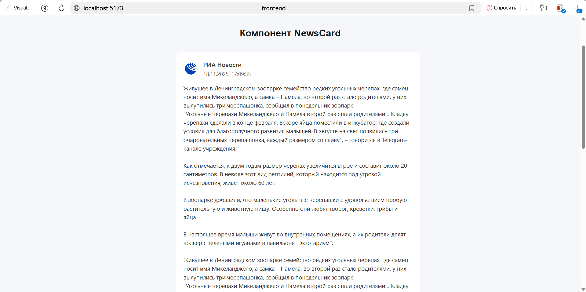
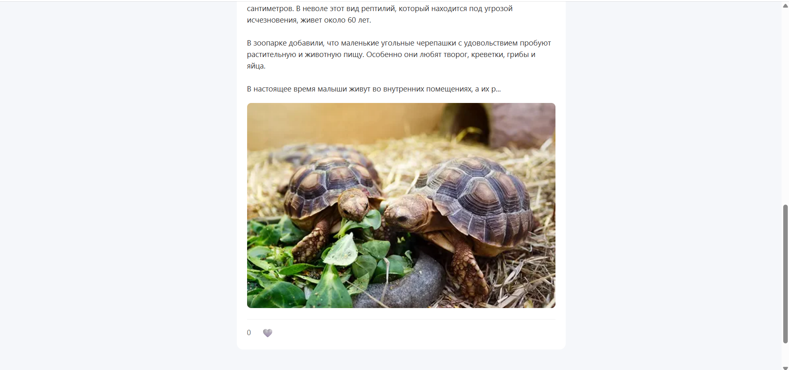
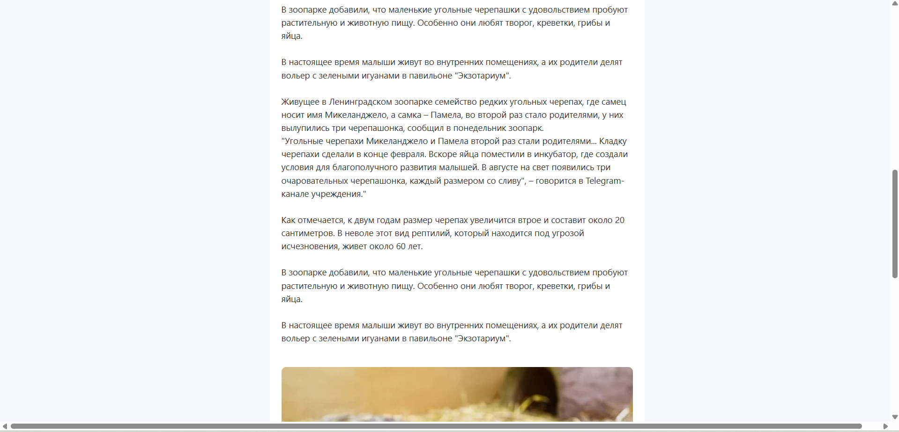
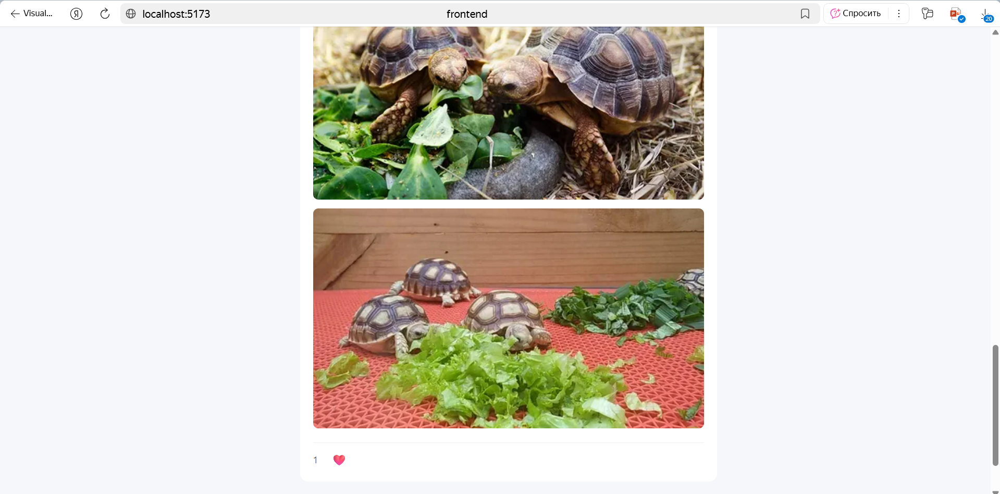

# Описание проекта
Этот проект представляет собой библиотеку React компонента и демонстрационное приложение, показывающее его использование. Проект разделен на:
frontend - демонстрационное приложение с примером использования компонента NewsCard
ui-library - библиотека переиспользуемого React компонента NewsCard, написанного на TypeScript

## Технологический стек
- React 19 
- TypeScript 
- Vite для сборки
- CSS Modules для стилизации
- Jest + Testing Library для тестирования
- ESLint для линтинга

## Установка и запуск
Предварительные требования:
- Node.js 18+
- npm 9+

1. Клонирование репозитория

git clone <repository-url>

cd lab5-react/solutions/student-14

2. Установка зависимостей и запуск UI Library

cd ui-library

npm install

npm run build

3. Запуск демо-приложения

cd ../frontend

npm install

npm run dev

4. Открытие в браузере

Приложение будет доступно по адресу: http://localhost:5173

## Скрипты
### ui-library
    npm run dev - сборка в watch-режиме
    npm run build - сборка библиотеки
    npm test - запуск тестов
    npm run lint - проверка кода
    npm run test:coverage - запуск тестов с генерацией отчета о покрытии кода

### frontend
    npm run dev - запуск dev-сервера
    npm run build - сборка библиотеки
    npm test - запуск тестов
    npm run lint - проверка кода

## Примеры работы приложения
1. Новостная карточка в закрытом состоянии

2. Новостная карточка в открытом состоянии с поставленным лайком

